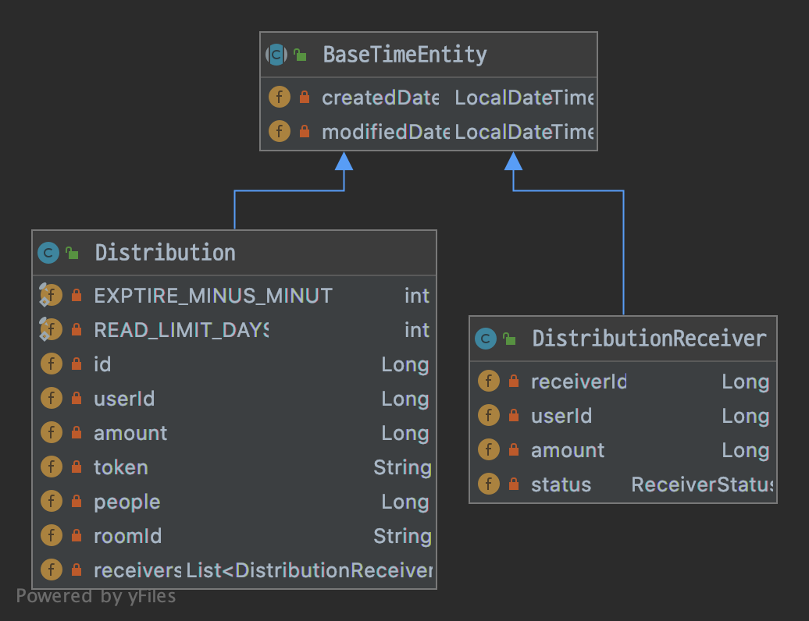

# kakaopay
> 2020 카카오페이

카카오페이 뿌리기 기능 구현하기

## Getting Started

### Prerequisites
- Spring boot 2.3.1.RELEASE
- Java 1.8.x
- Lombok plugin
- Gradle 6.4.1
- Mysql 5.6
- QueryDSL 4.3.1

## 요구사항
* 뿌리기, 받기, 조회 기능을 수행하는 REST API 를 구현
    * 요청한 사용자의 식별값은 숫자 형태이며 "X-USER-ID" 라는 HTTP Header로 전달됩니다.
    * 요청한 사용자가 속한 대화방의 식별값은 문자 형태이며 "X-ROOM-ID" 라는 HTTP Header로 전달됩니다.
    * 모든 사용자는 뿌리기에 충분한 잔액을 보유하고 있다고 가정하여 별도로 잔액에 관련된 체크는 하지 않습니다.
    
    
* 작성하신 어플리케이션이 다수의 서버에 다수의 인스턴스로 동작하더라도 기능에 문제가 없도록 설계되어야 합니다.
* 각 기능 및 제약사항에 대한 단위테스트를 반드시 작성합니다.

## 상세 구현 요건 및 제약사항
* 뿌릴 금액을 인원수에 맞게 분배하여 저장합니다.
* token은 3자리 문자열로 구성되며 예측이 불가능해야 합니다.


* token에 해당하는 뿌리기 건 중 아직 누구에게도 할당되지 않은 분배건 하나를 사용자에게 할당합니다.
* 뿌리기 당 한 사용자는 한번만 받을 수 있습니다.
* 자신이 뿌리기한 건은 자신이 받을 수 없습니다.
* 뿌리기가 호출된 대화방과 동일한 대화방에 속한 사용자만이 받을 수 있습니다.
* 뿌린 건은 10분간만 유효합니다.


* 뿌린 시각, 뿌린 금액, 받기 완료된 금액, 받기 완료된 정보 ([받은 금액, 받은 사용자 아이디] 리스트)
* 뿌린 사람 자신만 조회를 할 수 있습니다
* 뿌린 건에 대한 조회는 7일 동안 할 수 있습니다.

* README.md 파일에 문제해결 전략 작성
* Unit Test 코드 작성 

## 문제 해결
- 금액을 인원수에 맞게 분배
    - Random.nextInt을 이용하여 범위안에서 Random으로 분배 진행
    - 금액과 인원수가 동일한 경우 균등하게 분배
    
- token은 3자리 문자열 구현
    - Random.nextInt을 이용하여 범위( a-zA-Z )안에서 Random하게 추출
    
- 분배 할당
    - 분배한 금액 정보의 status를 저장하여 할당되지 않은 건을 요청한 사용자에게 할당
    
- 10분간 받기 유효 / 조회 7일 조회
    - 분배 시점의 생성시간을 이용하여 현재시간과 비교


## 패키지 구조 및 Http Request
```
├── README.md
├── http
│   └── DistributionApi.http
└── src
    ├── main
    │   ├── java
    │   │   └── com
    │   │       └── kakao
    │   │           └── problem
    │   │               ├── assets
    │   │               │   ├── entity
    │   │               │   ├── entrypoints
    │   │               │   ├── exception
    │   │               │   └── token
    │   │               ├── configuration
    │   │               │   ├── advisor
    │   │               │   ├── resolver
    │   │               │   └── spring
    │   │               └── distribution
    │   │                   ├── application
    │   │                   │   ├── request
    │   │                   │   └── response
    │   │                   ├── domain
    │   │                   ├── exptions
    │   │                   ├── infra
    │   │                   └── ui
    │   └── resources
    └── test

```

## Domain 구조


## API Spec

#### 뿌리기 API
```http
POST /distribution
```

| Header Name | Description |
| :--- | :--- |
| `X-ROOM-ID` | 대화방의 식별값 |
| `X-USER-ID` | 사용자의 식별값 |

| Paramaters | Type | Description |
| :--- | :--- | :--- |
| `amount` | `Number` | **Required**. 분배 금액 |
| `people` | `Number` | **Required**. 분배 인원수 |

##### Request
```javascript
{
  "amount": 1002,
  "people": 4
}
```

##### Response
```javascript
{
  "result": 200,
  "message": "OK",
  "data": {
    "token": "poR"
  }
}
```

#### 받기 API
```http
PUT /distribution/jdx
```

| Header Name | Description |
| :--- | :--- |
| `X-ROOM-ID` | 대화방의 식별값 |
| `X-USER-ID` | 사용자의 식별값 |


##### Response
```javascript
{
  "result": 200,
  "message": "OK",
  "data": {
    "amount": 800
  }
}
```

#### 조회 API
```http
GET /distribution/jdx
```

| Header Name | Description |
| :--- | :--- |
| `X-ROOM-ID` | 대화방의 식별값 |
| `X-USER-ID` | 사용자의 식별값 |


##### Response
```javascript
{
  "result": 200,
  "message": "OK",
  "data": {
    "totalAmount": 1002,
    "completionAmount": 800,
    "createdDate": "2020-06-27T05:21:23",
    "recivers": [
      {
        "userId": 2244,
        "amount": 800
      }
    ]
  }
}
```